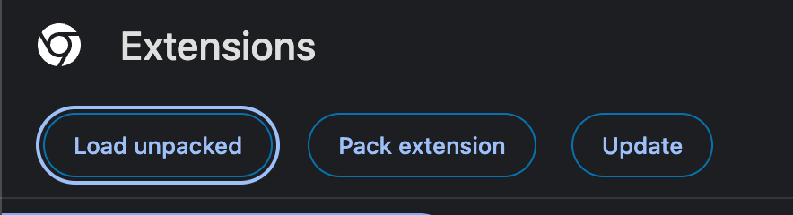
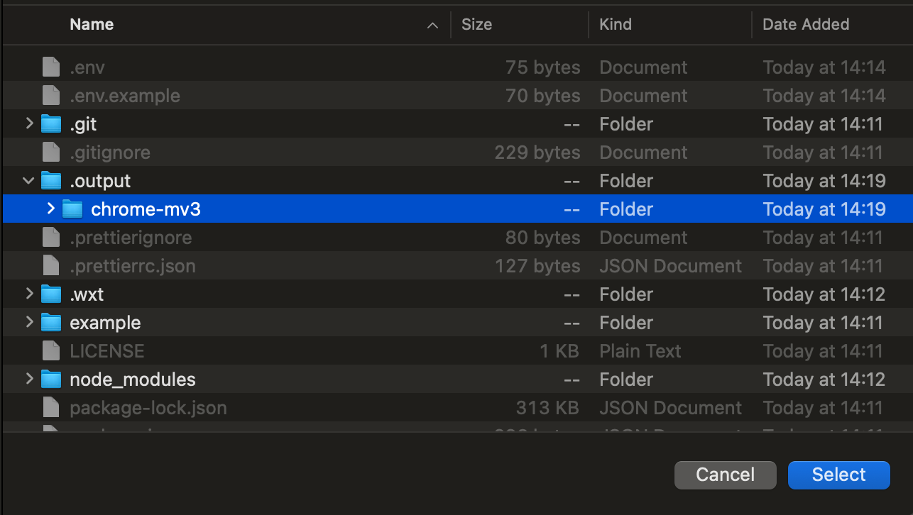
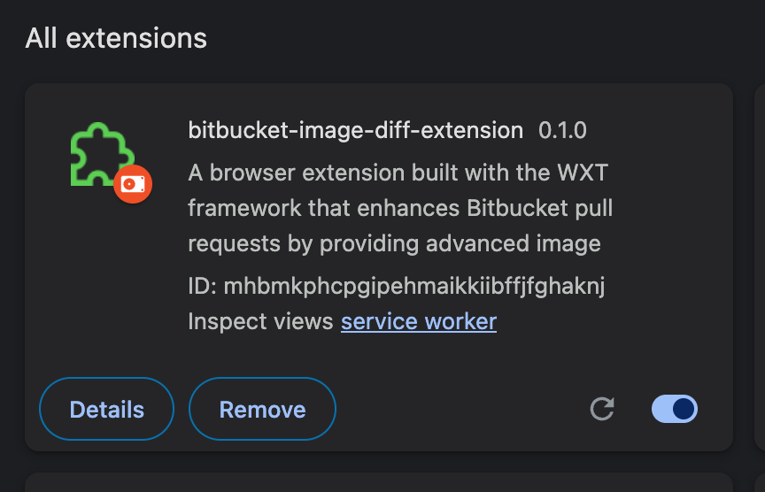
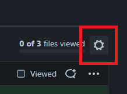

# Local Dev Setup

1. Clone this repo
2. Install dependencies ```npm i```
3. Run ```npm run postinstall```
4. Create a ```.env``` file in the root of this project and add a match url environment variable for your bitbucket for example: ```WXT_MATCH_URL=https://bitbucket.org/*```
5. Go in the ```wxt.config.ts``` and check the runner object, if you want to preserve the data of the dev browser uncomment the correct lines, else remove both
6. Start the dev server ```npm run dev``` and visit a PR with img Diffs on your Bitbucket
7. Open the Diff settings and then select ```All at once``` under Load Files and Save

# Build From Source

- run steps 1. - 4. see above
5. Run `npm run build`
6. Open Chrome Extensions or enter this in address bar: chrome://extensions/
7. Enable `Developer Mode`


8. Select `Load Unpacked`



9. On Mac: Show invisible files by pressing `cmd+shift+.`
10. Select `.output -> crome-mv3`



11. The Extension should be installed 

# Using with Bitbucket

1. Select PR Settings



2. Select Setting "All at once"


3. Refresh the page

If you set everything up correctly you can visit a pull request with an image diff.

Here is an example PR if you want to test the extension:
https://bitbucket.org/gametail/snapshotdiffexample/pull-requests/1/diff

Here is how it looks without the extension:


Here is how it looks with the extension:

